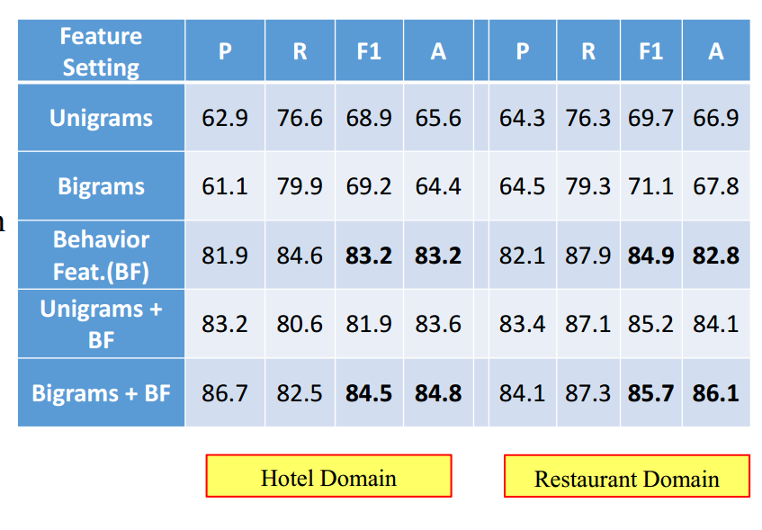

## 1.任务介绍

随着互联网的普及，电子商务飞速发展。而在电子商务中，商品的评论直接影响用户对商品的印象进而影响销量。在利益的驱动下部分商家和个人为了快速提高自身产品的竞争能力或者打击竞争对手的商品，通过刷单服务获取大量好评和销售量。同时投机者使用电子商务平台较大的点击量发布恶意信息，如广告信息、垃圾网络链接以及黄赌毒信息，产生大量垃圾评论。垃圾评论已经严重影响电子商务平台交易的公平性和用户的切身利益。如何保证用户评论信息的真实性和客观性以及如何检测类似的欺诈行为成为当前研究的一个热点，同时高质量的评论分析也是商品评论挖掘和情感分析的一个重要预处理步骤。本篇文章探讨了垃圾评论领域经典方法以及深度学习催生的新方法，并对比它们的效果。

垃圾评论主要分为两类，第一类是内容型垃圾评论，即在评论内容中发布广告、评论内容与主题相关性低和在评论内容中发布黄赌毒信息等；第二类为欺诈性评论，即评论发布者通过作弊手段达到提升信誉度、增加销售量的目的。如电商平台中的刷单服务就是典型的欺诈行为。

<!--more--> 

## 2.典型方法

垃圾评论特征主要来源于三种：评论内容、评论者以及被评论的商品。典型的垃圾评论检测方法分为利用评论文法信息、行为信息建模、以及数据统计建模三大类。在每一大类中又有很多具体的方法，以下对这些方法展开讨论和性能比较。

### 2.1 词法分析

对句子中的词进行词法分析建立稀疏语法树，从而获得更深层的语法特征。

采用线性分类器，5-fold交叉验证，主要采取了Lexical、Shallow syntax、Deep syntax等特征，具体特征值根据TF-IDF算法进行计算。根据论文[]中提供的结果，在数据集 Tripadvisor、Essay、Yelp上的结果分别如下：

| Feature Set | TripAd visor | Essay| Yelp|
|:-----------:|:------------:|:----:|:---:|
|     Words   |     88.4     |  77.0| 59.9|
|Shallow Syntax|    87.4     |  80.0| 62.0|
| Deep Syntax |     90.4     |  78.0| 63.5|
|Deep Syntax + Words|91.2    |  85.0| 64.3|

提升了3-8%的准确率。

### 2.2 建模行为信息

基于语言信息的模型很好，但是缺乏对撒谎行为上的捕捉、判别垃圾信号时容错性差、评论者非常容易逃脱规则。

#### 2.2.1 检测异常评论行为

垃圾评论者一般对所评论的商品有一定目标性，倾向于评论一类相似的产品，在论文[]中，定义了$E_{ij}$为用户$i$向用户$j$的评论。图标中呈现的是评论者——商品对的数量，一些评论者对同一件商品进行了多次评论，因此以目标商品为驱动的异常评论行为是存在的。

评论者对购物网站中产品的评论、评分、购买以及用户之间的交流行为都体现了其特定目的，通过对购物网站中评论者的行为特征分析，假设产品垃圾评论者存在以下 5 种行为模式：(1)同一用户对同一产品发表多个评论或多次评分的行为模式。(2)同一用户对同一产品组的不同产品发表多个评论或多次评分的行为模式。(3)用户评分与平均评分偏差较大的行为模式。(4)其他用户对某用户发表的评论回应较少的行为模式。(5)一个用户对产品的购买次数远小于评论次数的行为模式。根据用户的不同行为模式，针对用户进行建模，每个模型都采用打分的方法来衡量用户为垃圾评论者的可能性，得分越高为垃圾评论者的可能性就越大。关于五种行为的详细建模过程参考论文《基于用户行为的产品垃圾评论者检测研究》（邱云飞等）。

实验结果：

总体来说，实验的结果显示了本文方法在检测垃圾评论者与非垃圾评论者方面与手工标记垃圾评论者是大致相同的，尤其是目标产品组的方法更好地代表了用户的垃圾评论者的特征行为。

#### 2.2.2 群体行为分析

垃圾评论发布团体检测比垃圾评论发布者检测多一个用户团体的划分过程，通过聚类方式对评论进行用户团体划分，然后通过分析用户团体的异常行为检测欺诈型评论。

#### 2.2.3 基于图关系的方法

将评论者和评论连接，将评论与产品连接形成图，形成评论关系图。分别定义评论者可信度、评论真实度、商量可靠度等指标进行衡量。详细算法参考论文[Fei et al. ICWSM 2013]

#### 2.2.4 基于分布的方法

基于分布的方法主要是通过分析评论的时间分布、地域分布等信息检测垃圾评论。根据分布信息提取特征主要有以下几种：

1. 检测评论爆发；用马尔科夫随机场对评论发布信息建模[Fei et al.
ICWSM 2013]。
2. 在时域层面分析评论。分析垃圾评论和非垃圾评论发布时间的分布。
3. 分析IP和Cookie信息。
4. 地理信息。

根据文法信息提取特征和根据行为信息提取特征，实验对比：

### 2.3 统计建模

#### 2.3.1 矩阵分解

构建参数表达评论者和评论两者之间的关系以及两者的属性之间的关系，例如是否浏览过、打分记录等等参数，将特征组合在一起构成特征向量。将多组向量放在一起形成评论者和评论的关系矩阵，对关系矩阵进行张量分解[ Nickel et al. 2011]，从而得到映射到另一个空间，得到隐层特征。

## 3. 深度学习方法 

深度学习方法如卷积神经网络（CNN）和循环神经网络被广泛用于图像识别、自然语言处理等多个模式识别领域，在论文《Deceptive Opinion Spam Detection Using Neural Network》中，作者设计了CNN和RNN融合的深度学习模型，模型结构如下图：

论文中采用Word Embedding提取特征，实验结果如下：

## 4. 总结

本篇文章对垃圾评论检测典型方法与深度学习方法进行了总结，传统的评论文法分析、用户行为分析、矩阵分析等方法对垃圾评论检测效果逐步提升。而近几年来在图像和自然语言处理领域大显身手的卷积神经网络和循环神经网络也提高了垃圾评论检测的准确率处所有方法中领先水平。与传统方法不同的是，深度学习有更好的扩展性，通过改变结构、层数等方式较传统方法更容易获得效果提升。另外不同结构网络（CNN、RNN、DBN等）之间的配合重组有可能产生更好的效果。

## 参考文献

* Leman Akoglu, Rishi Chandy, and Christos Faloutsos. 2013. Opinion Fraud Detection in Online Reviews by Network Effects. In Proceedings of the AAAI International Conference on Web and Social Media.

* Shlomo Argamon, Casey Whitelaw, Paul Chase, Sobhan Raj Hota, Navendu Garg, and Shlomo Levitan. 2007. Stylistic text classification using functional lexical features. Journal of the American Society for Information Science and Technology, 58(6):802–822.

* Avrim Blum and Tom Mitchell. 1998. Combining labeled and unlabeled data with co‐training. In Proceedings of the eleventh annual conference on Computational learning theory, pages 92–100. Jacob Eisenstein, Brendan O’Connor, Noah A. Smith, and Eric P. Xing. 2010. A latent variable model for geographic

* lexical variation. Empirical Methods in Natural Language Processing:1277–1287, October. G. Fei, A. Mukherjee, B. Liu, M. Hsu, M. Castellanos, and R. Ghosh. 2013. Exploiting Burstiness in Reviews for Review Spammer Detection. AAAI International Conference on Weblogs and Social Media.

* Song Feng, Longfei Xing, Anupam Gogar, and Yejin Choi. 2012. Distributional Footprints of Deceptive Product Reviews. In The International AAAI Conference on Weblogs and Social Media.

* Y. Feng, S., Banerjee R., Choi. 2012. Syntactic Stylometry for Deception Detection. In Association for
Computational Linguistics.

* Donato Hernandez Fusilier, Rafael Guzman Cabrera, Manuel Montes‐y‐Gomez, and Paolo Rosso. 2013. Using PU‐
Learning to Detect Deceptive Opinion Spam. ACL Workshop on Computational Approaches to Subjectivity,
Sentiment and Social Media Analysis.

* Aristides Gionis, Piotr Indyk, and Rajeev Motwani. 1999. imilarity Search in High Dimensions via Hashing.Proceedings of the 25th International Conference on Very Large Data Bases:518–529, September.

* Nitin Jindal and Bing Liu. 2007. Review spam detection. In Proceedings of the 16th international conference on World Wide Web ‐ WWW ’07, page 1189, New York, New York, USA, May. ACM Press.

* Nitin Jindal and Bing Liu. 2008. Opinion Spam and Analysis. In ACM International Conference on Web Search and Data Mining.

* Sangkyum Kim, Hyungsul Kim, Tim Weninger, Jiawei Han, and Hyun Duk Kim. 2011. Authorship classification: a discriminative syntactic tree mining approach. In Proceedings of the 34th international ACM SIGIR conference on Research and development in Information Retrieval, pages 455–464.